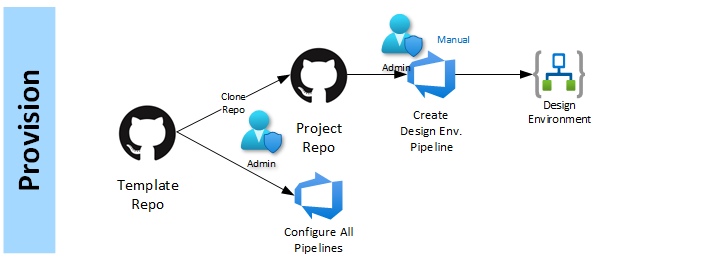
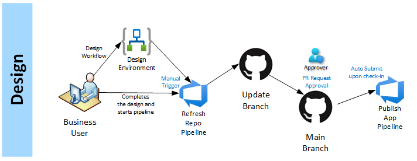
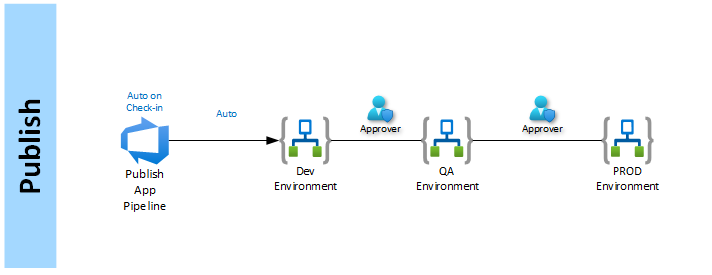

# Updating Logic App Repository

This pipeline will scan an existing Logic App in the Azure portal and pull down the source code for that application into a local repository.  

---

**Step 1:** Initialize: An admin will fork this repo and set up the required pipelines.

**Step 2:** Design: User will design the logic app in the Azure portal. Once completed, they will manually trigger the "Refresh workflow" pipeline to copy those changes into a new branch and create a pull request, which can update the main branch of the source code repository.

**Step 3:** Deploy: Upon check-in to main branch, a pipeline can be automatically triggered to start the publish deploy pipeline to the production environments.

