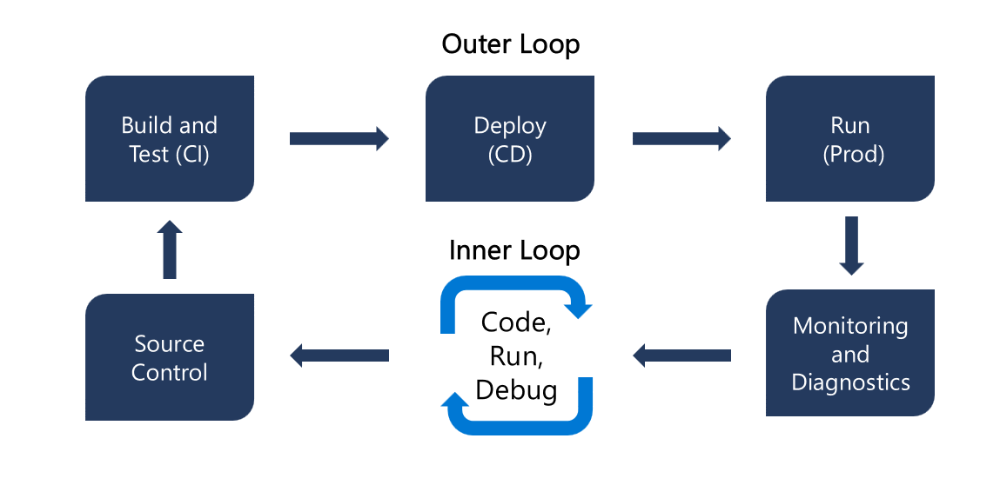
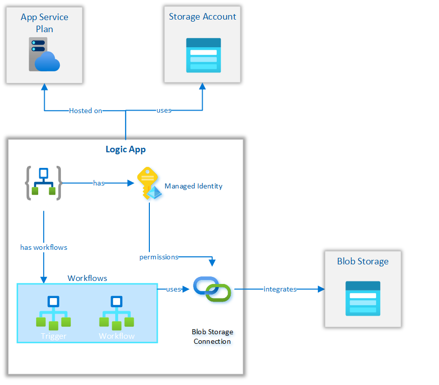
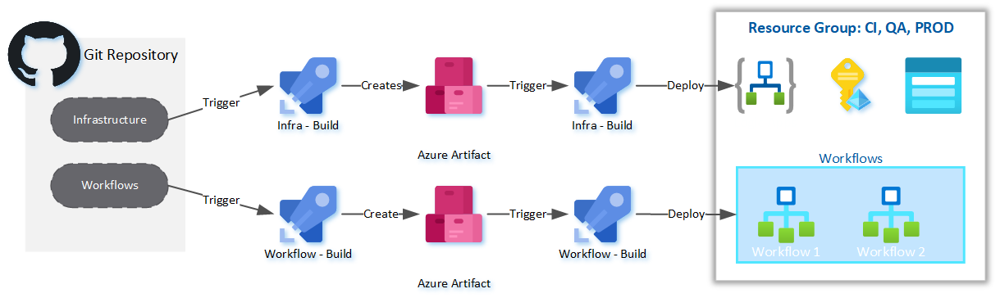

# Logic Apps Standard DevOps - Accelerator

[][1]

[1]: https://vscode.dev/github/lluppesms/logicapps.standard.demo/


[](https://github.com/lluppesms/logicapps.standard.demo/actions/workflows/deploy-infra-logicapp.yml)

---

Azure Logic Apps Standard provides an opportunity to enable a traditional developer workflow, and associated benefits(local development, source control, automation) with low code tooling. The goal of this repository is to augment existing documentation to accelerate the use of CICD practices enabled with [Azure Logic Apps Standard](https://docs.microsoft.com/en-us/azure/logic-apps/devops-deployment-single-tenant-azure-logic-apps). This is accomplished by providing a demo implementation and highlighting best practices and workarounds to common challenges.

***Aligns with traditional CI/CD Delivery Model***



***Separation of Concerns***


The single-tenant model gives you the capability to separate the concerns between app and the underlying infrastructure. For example, you can develop, build, zip, and deploy your app separately as an immutable artifact to different environments. Logic app workflows typically have "application code" that you update more often than the underlying infrastructure. By separating these layers, you can focus more on building out your logic app's workflow and spend less on your effort to deploy the required resources across multiple environments.

---

## Solution Components

The following diagram shows the dependencies between the demo logic app solution and the infrastructure resources:



***Hosting***

An app service plan and storage account resource are needed to host the logic app standard runtime.

***Security***

A Managed Identity, associated with the resource is used to access different azure resources. Azure RBAC can be used to assign access.

***Logic***

An 'EventTrigger' and 'EventProcessor' workflows are persisted as JSON files and deploy into the Logic App

***Azure Connectors***

Azure BlobStorage Managed connector provides access to Azure blob storage.

## CICD Design



---

## Challenges and Known Issues

### Local Development

1. Version compatibility exist between development tools and extensions. Azurite v3.16.0 with Logic App Standard extension is known to work v1.0.14.
2. Locally AppSettings do not resolve in Connections.json. Having local versions of files that are swapped with Azure versions is a workaround.
3. Managed Identities cannot be used to connect with Azure Connectors. Locally you will need versions of Azure connectors that can be used with keys/connection strings and config can be swapped at build.
4. VSCode workspace root needs to be at the workflow folder otherwise connection.json and other files generated by the designer get put in the wrong place.

### CICD

1. Lack of ARM/Bicep schema documentation exits for many connectors.
2. Schema for using ManagedIdentity with Managed Connection is not well documented. [Link](https://github.com/Azure/bicep/issues/5516)
3. Development done in Azure Portal needs to be manually copied to source control.

### Links

- https://github.com/Azure/logicapps/issues/609

---

## Local Development

### Prerequisites

#### 1. Development Tools

Follow the prerequisite guide [here](https://docs.microsoft.com/en-us/azure/logic-apps/create-single-tenant-workflows-visual-studio-code#prerequisites)

> **Note**
> There is a bug with Azurite 3.17 so currently the best way to install Azureite is via NPM:
>
> ``` bash
> npm uninstall -g azurite
> npm install -g azurite@3.16.0
> ```

---

### CI/CD Pipeline Setup

1. [Deploy using AZD Command Line Tool](/Docs/AzdDeploy.md)

2. [Deploy using Azure DevOps](/Docs/AzureDevOps.md)

3. [Deploy using GitHub Actions](/Docs/GitHubActions.md)


A Service Principal is required with Owner RBAC to a Resource Group in Azure. The following resources will be created as part of the IaC.

- Storage Account for Logic App
- Logic App Service
- Log Analytics
- Application Insights
- Storage Account for Integration

---

## Reference

### Local Development

- https://docs.microsoft.com/en-us/azure/logic-apps/create-single-tenant-workflows-visual-studio-code

### CICD

- https://docs.microsoft.com/en-us/azure/logic-apps/devops-deployment-single-tenant-azure-logic-apps
- https://docs.microsoft.com/en-us/azure/logic-apps/set-up-devops-deployment-single-tenant-azure-logic-apps?tabs=github
- https://mattruma.com/adventures-with-logic-apps-using-bicep-to-deploy-logic-apps/

### Observability

- https://docs.microsoft.com/en-us/azure/logic-apps/create-single-tenant-workflows-azure-portal#enable-or-open-application-insights-after-deployment
